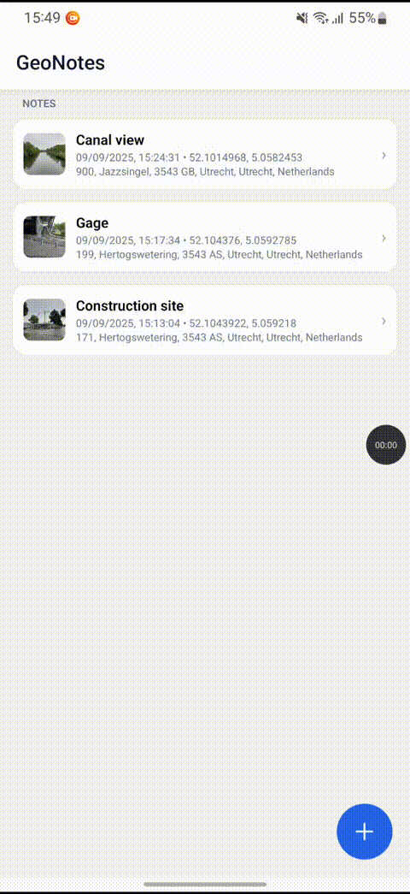

# GeoNotes

A lightweight, offline-first **Android** notes application built with **React Native**, **Expo Router**, and **SQLite**. Create, edit, and manage notes enriched with photos and geolocation (GPS coordinates resolved to a human-readable address).

## Table of Contents

- [Features](#features)
- [Demo](#demo)
- [Releases & Downloads](#releases--downloads)
- [Requirements](#requirements)
- [Tech Stack](#tech-stack)
- [Project Structure](#project-structure)
- [Architecture Overview](#architecture-overview)
- [Quick Start](#quick-start)
- [Development](#development)
- [Testing](#testing)
- [Building (APK)](#building-apk)
- [Runtime Permissions](#runtime-permissions)

## Features

- Create notes with **title**, **plain body text**, and an **optional photo**.
- Automatic **geotagging** (latitude/longitude) with **reverse-geocoded address**.
- List, view, edit, and delete notes.
- **Local persistence** via SQLite; works offline.
- Minimal, clean UI styled with Tailwind-like utilities (NativeWind).

## Demo

### Add new note


### Edit & pin note



## Releases & Downloads

Prebuilt artifacts are published on the **GitHub Releases** page. For convenience, a signed **APK** is attached to each tagged release so you can install the app on Android without the Play Store.

## Requirements

- **Node.js** ≥ 20
- **npm**
- Android device with **Expo Go** _or_ an **Android emulator**.

## Tech Stack

- [React Native](https://reactnative.dev/)
- [Expo](https://expo.dev/)
- [Expo Router](https://expo.github.io/router/)
- [Expo SQLite](https://docs.expo.dev/versions/latest/sdk/sqlite/)
- [Expo Location](https://docs.expo.dev/versions/latest/sdk/location/)
- [Expo ImagePicker](https://docs.expo.dev/versions/latest/sdk/imagepicker/)
- [NativeWind](https://www.nativewind.dev/) (Tailwind‑style utilities)
- [Vitest](https://vitest.dev/)

## Project Structure

```
app/
  +not-found.tsx
  index.tsx            # Notes list (home)
  create.tsx           # Create note
  note/
    [id].tsx           # Note details
    [id]/
      edit.tsx         # Edit note
components/
  ...                  # Reusable UI (e.g., Note card, buttons)
lib/
  utils/               # Shared helpers (image, location, formatting)
  db.ts                # SQLite persistence & queries
  mappers.ts           # DB mappers
  pins.ts              # Pinned notes Async Storage
```

## Architecture Overview

- **App shell & navigation:** Expo Router (file‑system based routing)
- **Data layer:** SQLite (Expo SDK) with a thin repository in `lib/db.ts`
- **Device capabilities:** Camera (image capture) & Media Library (image pick), Location (GPS + reverse geocoding)
- **Presentation:** Functional RN components, NativeWind utility classes
- **Testing:** Unit tests with Vitest

## Quick Start

1. Clone

```bash
git clone https://github.com/begiedz/geo-notes.git
cd geo-notes
```

2. Install deps

```bash
npm install
```

3. Start the dev server (Metro)

```bash
npm run start
```

Scan the QR code with Expo Go (Android) or press "a" to launch an Android emulator.

## Development

Common commands:

Start dev server:

```bash
npm run start
```

Launch directly to Android emulator:

```bash
npx expo start --android
```

## Testing

Run unit tests:

```bash
npm run test
```

## Building (APK)

This project uses **EAS Build** to produce an installable **APK** for quick testing and releases.

Produces an APK suitable for direct install on devices:

```bash
npx eas build -p android --profile preview
```

The resulting APK is ideal for testers and will be attached to **GitHub Releases** for convenience.

## Runtime Permissions

The app requests the following at runtime:

- **Camera / Media Library** – to capture or pick a photo for a note.
- **Location** – to attach GPS coordinates and resolve an address.

If a permission is denied, the corresponding feature will be degraded (e.g., notes without photos or location).
